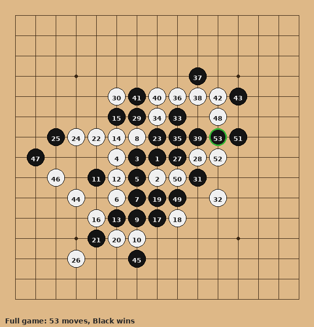
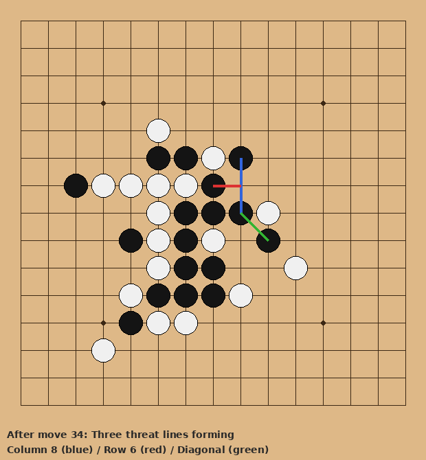
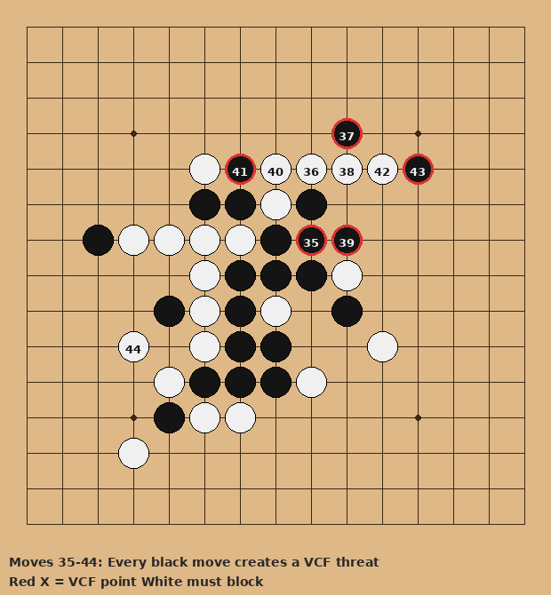
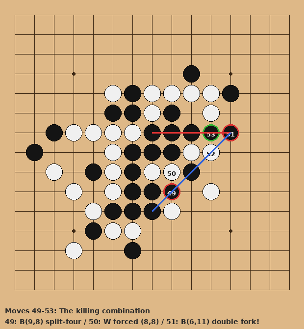

# 对局复盘：人类 vs AI（Level 6 Neural）

**日期**：2026-04-16
**黑方**：人类
**白方**：AI（CNN + MCTS 80 sims）
**结果**：黑胜，53 手

---

## 总评

这是一盘教科书级别的**连续施压（VCT）**胜局。黑方在中盘阶段同时经营三条威胁线——第 8 列纵线、第 6 行横线、右上对角线——从第 35 手开始，每一步落子都迫使白方进入被动防守。白方疲于奔命，逐一扑灭威胁，但黑方不断变换进攻线路，最终以一记精妙的**双分裂四**叉杀收局。

赛后由 AI 引擎（VCF/VCT 战术搜索）逐步回溯分析确认：黑方的进攻路线在战术上**严格正确**——不是凑巧赢的，是真的把白方逼入了理论无解的局面。即使将 AI 模拟次数提升至 5000 次，仍然找不到有效防御。

---

## 全局总览



53 手完整棋谱。黑 1 占天元，序盘在中央展开。注意黑棋的子力分布——不是集中在一条线上，而是广泛布局，为中盘的多线攻击埋下伏笔。

---

## 第一阶段：三线并进（1–34 手）



黑方的布局不急于一条线做大，而是悄然在三个方向积累力量：

- **蓝线（第 8 列）**：B(7,8) → B(5,8) → B(6,8)，三子纵线
- **红线（第 6 行）**：B(6,7) → B(6,8)，横线伏笔
- **绿线（对角线）**：B(7,8) → B(8,9)，斜线萌芽

三条线共享关键交叉点 B(6,8) 和 B(7,8)，形成互相支撑的**威胁网络**。白方在此阶段各处有应，但没有意识到这三条线正在汇聚成一张网——而这张网一旦织成，就再也逃不出去了。

---

## 第二阶段：连续施压（35–44 手）



从第 35 手开始，局面进入了黑方的**攻击节奏**。VCF 引擎逐手分析揭示了一个惊人的事实：

| 手数 | 黑方落子 | 制造的 VCF 威胁 | 白方应对 |
|------|---------|---------------|---------|
| 35 | B(6,8) | VCF → (4,8) | W(4,8) 堵住 ✓ |
| 37 | B(3,9) | VCF → (4,9) | W(4,9) 堵住 ✓ |
| 39 | B(6,9) | VCF → (9,8) | W(4,7) 化解 ✓ |
| 41 | B(4,6) | VCF → (9,8) | W(4,10) 化解 ✓ |
| 43 | B(4,11) | VCF → (5,10) | W(9,3) 未防 ✗ |

**每一步黑棋都在制造新的必杀威胁，每一步白棋都在灭火。** 白方已经没有任何进攻的机会。

黑方的高明之处在于：这些 VCF 威胁分布在不同方向上。白方堵住一条线，黑方立刻在另一条线上重新施压。这不是碰运气，这是对棋盘全局的精确掌控——每一步"被挡住"的棋，实际上都在为下一轮攻击积累资源。

---

## 第三阶段：致命一击（49–53 手）



当所有线路都积蓄到位，黑方发动了最后的组合拳：

### 第 49 手 B(9,8)：引爆

在第 8 列打入，制造**分裂四**：

```
第 8 列：X(5,8) X(6,8) X(7,8)  __  X(9,8)
                                 ↑ 间隔
```

白方别无选择，(8,8) 不堵就是连五。

### 第 50 手 W(8,8)：被迫

白方填入间隔，防住了纵线。但为时已晚——

### 第 51 手 B(6,11)：一石双杀

这是全局的华彩之笔。一颗子，同时造出**两条分裂四**：

```
红线（横向）：X(6,7) X(6,8) X(6,9)  __  X(6,11)  → 填(6,10)即五连
蓝线（对角）：X(6,11)  __  X(8,9) X(9,8) X(10,7)  → 填(7,10)即五连
```

两条必杀线，两个不同的关键点。白方一步只能堵一个——**无解。**

### 第 53 手 B(6,10)：收官

白方堵了对角线 (7,10)，黑方从容填入 (6,10)，横向五连，终局。

---

## 关键数据

- 黑方从第 35 手起，**连续 9 步制造 VCF 威胁**，白方全程被迫防守
- 最终的双分裂四涉及三条线路（纵、横、斜）的交汇，属于五子棋中**难度最高的组合杀**之一
- AI 引擎确认：即使 MCTS 模拟次数提升至 5000 次，白方仍然找不到有效防御——**这个局面理论无解**
- 赛后为了应对这盘棋暴露的弱点，AI 引擎新增了分裂棋型检测和 VCT 战术搜索

---

## 一句话点评

> 白方不是下得差，是对手太强。面对一位能在三个方向同时编织威胁网、用连续施压耗尽防守资源、最后以双分裂四叉杀收局的对手——认输不丢人。
